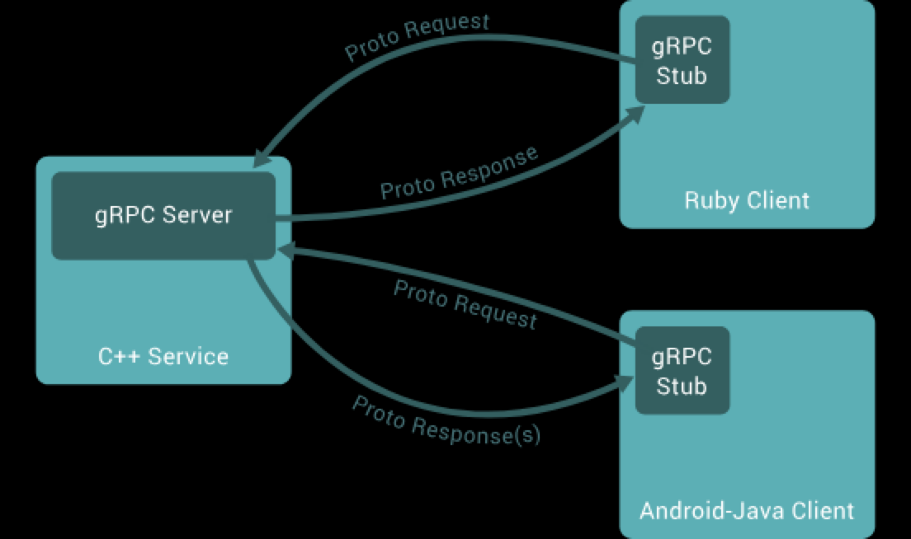

= GRPC fundamentals

== Sources

* https://grpc.io/docs/what-is-grpc/introduction/

== Introduction scribble

* open source remote procedure call ?
** how is RPC different from REST ?

* RPC : calling method on remote server as if its local (?)
* IDL (Interface definition language) : write API contract in .proto and .gprc generates client server code (?)
* Gprc used HTTP/2 (what is the difference betweens 2 and 1 | does REST use HTTP 1 ??)

* (client side) gRPC is based around the idea of defining a service, specifying the methods that can be called remotely with their parameters and return types
** On the server side, the server implements this interface and runs a gRPC server to handle client calls
** On the client side, the client has a stub (referred to as just a client in some languages) that provides the same methods as the server.

* How to (from the tutorial)

** define grpc service and method request response using protobuf
*** What is service ?? (is it a client stub ??)

== Notes of the first test

* Downloaded protoc and the java plugin
* Need to know where to place the generated files is the source repo ??
* From the service created :
** The service does not have the return (the overriding child), it has StreamObserver ??
** seems to be a callback to the server the client calls ?? (helps in making blocking and unblocking call) | impact on the client (to be seen)

[NOTES]
====

* why javax annotation is being used

generated gRPC service uses:

@javax.annotation.Generated – for standard Java tooling (not protobuf-specific) ??

@io.grpc.stub.annotations.GrpcGenerated – for gRPC-specific tagging

====

* use this for spring boot managed grpc project : https://www.baeldung.com/spring-boot-grpc
